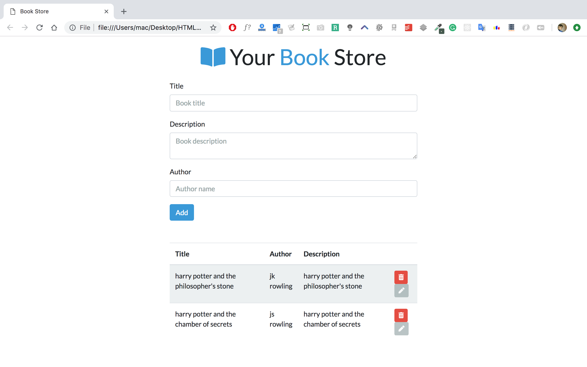
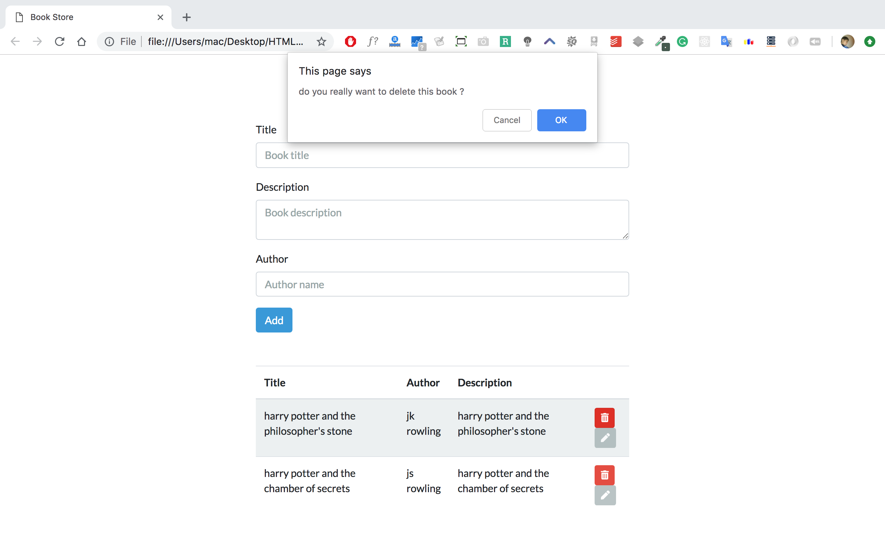
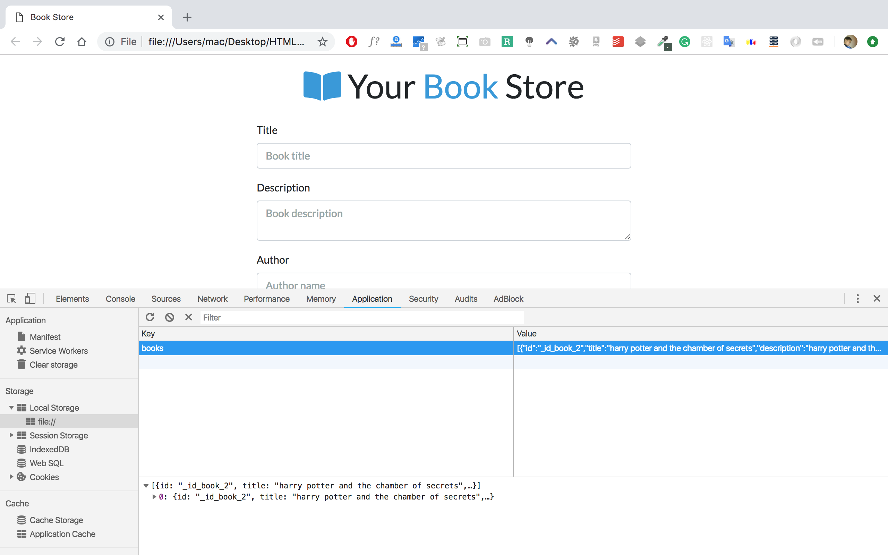

# First Session 22/02/2019

## The plan of this sessions

    1. The Web Architecture and How to Internet/Web works ?
    2. Why Javascript is so important ?
    3. Javascript in server-side ?
    4. What are we going to learn ?
    5. ES6 crash course.

## Resorces

[Web Architecture 101](https://engineering.videoblocks.com/web-architecture-101-a3224e126947)

> In this article you will find out how to web works behind the scenes and all the involved parties in this operation.

[Developer Roadmap](https://github.com/kamranahmedse/developer-roadmap)

> A must have support that shows the road map of a web developer, including front-end back-end and devops.

[Performance Comparison Between Node.js and Java EE](https://dzone.com/articles/performance-comparison-between)

> Since we're interested in java and JEE is the main technology in our curriculum. this is a simple comparison of the JEE vs Node.js performance. **`BUT`** there other cases where JEE overcome Node.js.

[JavaScript Tutorial - JavaScript for Beginners | Mosh](https://www.youtube.com/watch?v=W6NZfCO5SIk)

> This is a 50min javascript crash course. that contains all what you need to know to start coding in javascript or do our first application.

## Application

    Create a simple application that gives user the hand to create some books. each book has id, title, description and author.
    The user can delete the books
    PS: the books array is stored in the local storage so that each time we refresh the page we still have the books.

---

> ### #Happy_Coding ❤️